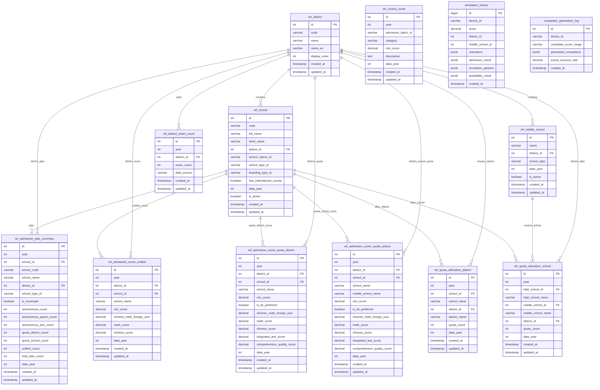

# 数据库ER图

## 概述

上海中考招生模拟系统的数据库包含以下主要模块：
- **基础数据**：区县、高中学校、初中学校
- **招生计划**：年度招生计划汇总
- **历史分数线**：统一招生、名额分配到区、名额分配到校分数线
- **名额分配**：名额分配到区、名额分配到校计划
- **模拟数据**：模拟历史、竞争对手生成日志

---

## ER图 (Mermaid)



---

## 表分类说明

### 1. 基础数据表 (3张)

| 表名 | 说明 | 主要字段 |
|------|------|---------|
| `ref_district` | 区县基础信息 | id, code, name |
| `ref_school` | 高中学校信息 | id, code, full_name, district_id |
| `ref_middle_school` | 初中学校信息 | id, name, district_id |

### 2. 招生计划表 (1张)

| 表名 | 说明 | 主要字段 |
|------|------|---------|
| `ref_admission_plan_summary` | 年度招生计划汇总 | year, school_id, autonomous_count, quota_district_count, quota_school_count, unified_count |

### 3. 历史分数线表 (4张)

| 表名 | 说明 | 主要字段 |
|------|------|---------|
| `ref_admission_score_unified` | 统一招生分数线 | year, district_id, school_id, min_score |
| `ref_admission_score_quota_district` | 名额分配到区分数线 | year, district_id, school_id, min_score |
| `ref_admission_score_quota_school` | 名额分配到校分数线 | year, district_id, school_id, middle_school_name, min_score |
| `ref_control_score` | 各批次最低控分线 | year, admission_batch_id, category, min_score |

### 4. 名额分配计划表 (2张)

| 表名 | 说明 | 主要字段 |
|------|------|---------|
| `ref_quota_allocation_district` | 名额分配到区计划 | year, school_id, district_id, quota_count |
| `ref_quota_allocation_school` | 名额分配到校计划 | year, high_school_id, middle_school_id, quota_count |

### 5. 辅助数据表 (1张)

| 表名 | 说明 | 主要字段 |
|------|------|---------|
| `ref_district_exam_count` | 各区中考人数 | year, district_id, exam_count |

### 6. 模拟相关表 (2张)

| 表名 | 说明 | 主要字段 |
|------|------|---------|
| `simulation_history` | 模拟历史记录 | device_id, score, volunteers, admission_result |
| `competitor_generation_log` | 竞争对手生成日志 | device_id, candidate_score_range, generated_competitors |

---

## 核心关系图

```
                    +-------------------+
                    |   ref_district    |
                    |     (区县表)       |
                    +--------+----------+
                             |
           +-----------------+------------------+
           |                 |                  |
           v                 v                  v
    +-------------+   +-------------+   +------------------+
    | ref_school  |   |ref_middle_  |   |ref_district_     |
    |  (高中表)    |   |school(初中) |   |exam_count(人数)  |
    +------+------+   +------+------+   +------------------+
           |                 |
           |                 |
           v                 v
    +----------------------------------------------+
    |              招生计划 & 分数线                |
    +----------------------------------------------+
    | ref_admission_plan_summary    (招生计划)     |
    | ref_admission_score_unified   (统一招生)     |
    | ref_admission_score_quota_    (名额到区)     |
    | ref_admission_score_quota_    (名额到校)     |
    +----------------------------------------------+
                             |
                             v
    +----------------------------------------------+
    |              名额分配计划                     |
    +----------------------------------------------+
    | ref_quota_allocation_district  (到区计划)    |
    | ref_quota_allocation_school    (到校计划)    |
    +----------------------------------------------+
```

---

## 数据量统计 (2026-02-22)

| 表名 | 记录数 |
|------|--------|
| ref_district | 17 |
| ref_school | ~300 |
| ref_middle_school | 726 |
| ref_admission_plan_summary | 189 (2025年) |
| ref_admission_score_unified | 457 (2025年) |
| ref_admission_score_quota_district | 914 |
| ref_admission_score_quota_school | 3672 |
| ref_quota_allocation_district | 76 (2025年) |
| ref_quota_allocation_school | 2537 (2025年) |

---

## 字段说明

### ref_district (区县表)

| 字段 | 类型 | 说明 |
|------|------|------|
| id | int | 主键 |
| code | varchar | 区县代码 |
| name | varchar | 区县名称 |
| name_en | varchar | 英文名称 |
| display_order | int | 显示顺序 |

### ref_school (高中学校表)

| 字段 | 类型 | 说明 |
|------|------|------|
| id | int | 主键 |
| code | varchar | 学校代码 |
| full_name | varchar | 学校全称 |
| short_name | varchar | 学校简称 |
| district_id | int | 所属区县FK |
| school_nature_id | varchar | 学校性质(公办/民办) |
| school_type_id | varchar | 学校类型(普通/重点) |
| boarding_type_id | varchar | 住宿类型 |
| has_international_course | boolean | 是否有国际课程 |
| data_year | int | 数据年份 |
| is_active | boolean | 是否有效 |

### ref_admission_score_unified (统一招生分数线)

| 字段 | 类型 | 说明 |
|------|------|------|
| id | int | 主键 |
| year | int | 年份 |
| district_id | int | 区县FK |
| school_id | int | 学校FK |
| school_name | varchar | 学校名称 |
| min_score | decimal | 最低分数线 |
| chinese_math_foreign_sum | decimal | 语数外总分 |
| math_score | decimal | 数学成绩 |
| chinese_score | decimal | 语文成绩 |
| data_year | int | 数据年份 |

---

## 更新记录

| 日期 | 说明 |
|------|------|
| 2026-02-22 | 初始版本，基于现有数据库结构生成 |
