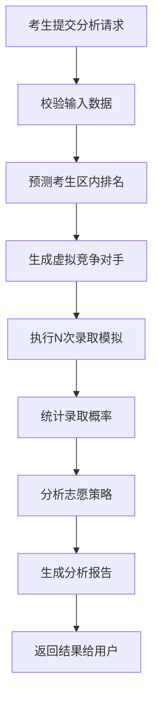
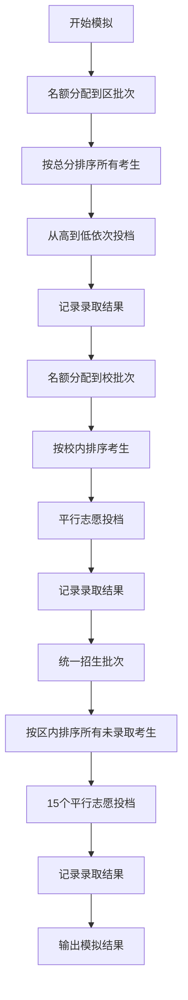

# 上海中考招生模拟系统 - 需求文档

> 版本：v1.0
> 最后更新：2025-02-01
>
> 详细政策规则和数据来源请参考 [参考备忘](reference.md)

---

## 1. 系统目标

本系统是一个**中考志愿填报分析辅助工具**，帮助考生评估自己的录取概率，优化志愿填报策略。

### 核心价值

1. **录取概率评估**：基于考生成绩和排名，预测各志愿的录取成功概率
2. **志愿策略分析**：分析志愿梯度的合理性，提供优化建议
3. **竞争态势模拟**：通过虚拟竞争对手模拟真实的录取竞争环境

### 不包含的功能

- 不支持自主招生录取批次模拟
- 不提供实际的志愿填报服务
- 不保证模拟结果的绝对准确性

---

## 2. 用户角色

### 2.1 考生（主要用户）

**角色描述**：上海市参加中考的应届初三学生，需要填报高中志愿。

**核心需求**：
- 了解自己的成绩和排名能考上哪些学校
- 评估自己填报的志愿是否合理
- 获得志愿填报的优化建议

**输入信息**：
- 基本信息：所在区、初中学校
- 成绩信息：中考总分、各科成绩、校内排名
- 志愿清单：名额分配到区、名额分配到校、1-15志愿

### 2.2 管理员（次要用户）

**角色描述**：负责维护系统基础数据和招生数据的管理人员。

**核心需求**：
- 导入历年录取分数线数据
- 导入各校招生计划数据
- 管理学校信息和区县信息

---

## 3. 用户故事

### 3.1 考生用户故事

#### US-01: 提交模拟分析请求

**作为**一名考生
**我想要**输入我的成绩、排名和志愿清单
**以便于**系统分析我的录取概率

**验收标准**：
- [ ] 可以输入所在区、初中学校
- [ ] 可以输入中考总分和各科成绩
- [ ] 可以输入校内排名（如：15/300）
- [ ] 可以填报名额分配到区志愿（1个）
- [ ] 可以填报名额分配到校志愿（2个，如具备资格）
- [ ] 可以填报1-15志愿（最多15个）
- [ ] 系统校验输入数据的合法性

#### US-02: 查看录取概率分析

**作为**一名考生
**我想要**看到每个志愿的录取概率
**以便于**了解自己被各学校录取的可能性

**验收标准**：
- [ ] 显示每个志愿的录取概率百分比
- [ ] 显示风险等级（安全/稳妥/冲刺/高风险）
- [ ] 显示与历年录取分的对比
- [ ] 显示预计的竞争排名

#### US-03: 获取志愿策略建议

**作为**一名考生
**我想要**获得志愿填报策略的分析和建议
**以便于**优化我的志愿清单

**验收标准**：
- [ ] 分析志愿梯度分布（冲刺/稳妥/保底）
- [ ] 识别志愿填报中的风险点
- [ ] 提供志愿优化建议
- [ ] 生成可导出的分析报告

#### US-04: 查看竞争对手分析

**作为**一名考生
**我想要**了解与我竞争同一学校的考生情况
**以便于**更好地评估录取难度

**验收标准**：
- [ ] 显示虚拟竞争对手的数量和分数分布
- [ ] 显示竞争对手的志愿填报情况
- [ ] 对比自己与竞争对手的优劣势

#### US-05: 查看历年数据对比

**作为**一名考生
**我想要**对比历年录取分数线
**以便于**了解学校录取的分数趋势

**验收标准**：
- [ ] 显示目标学校近2-3年的录取分数线
- [ ] 显示分数线变化趋势
- [ ] 标注特殊年份的数据说明

### 3.2 管理员用户故事

#### US-101: 导入招生计划数据

**作为**一名管理员
**我想要**导入各校的招生计划数据
**以便于**系统使用最新的招生信息

**验收标准**：
- [ ] 支持CSV文件上传
- [ ] 校验数据格式和必填字段
- [ ] 标记并报告异常数据
- [ ] 更新成功后通知相关模块

#### US-102: 导入录取分数线数据

**作为**一名管理员
**我想要**导入历年的录取分数线数据
**以便于**系统提供历年对比分析

**验收标准**：
- [ ] 支持按年份、批次、区县导入
- [ ] 校验学校代码的一致性
- [ ] 处理重复数据（更新或跳过）
- [ ] 记录数据来源和导入时间

#### US-103: 管理学校信息

**作为**一名管理员
**我想要**维护高中学校的基本信息
**以便于**系统能正确识别和展示学校

**验收标准**：
- [ ] 添加/编辑学校信息
- [ ] 设置学校类型（市重点/区重点/一般高中）
- [ ] 设置学校所属区县
- [ ] 标记学校招生代码

#### US-104: 管理区县信息

**作为**一名管理员
**我想要**维护上海16个区县的基本信息
**以便于**系统能正确处理各区数据

**验收标准**：
- [ ] 维护区县代码和名称
- [ ] 维护各区中考报名人数
- [ ] 设置各区的招生计划分配

---

## 4. 功能需求

### 4.1 核心功能模块

#### F1: 志愿填报模块

**功能描述**：提供用户输入中考成绩、排名和志愿清单的界面。

**输入项**：
- 考生所在区（16选1）
- 考生初中学校（根据区筛选）
- 是否具备名额分配到校资格
- 中考总分（0-750）
- 各科成绩（语文、数学、外语、综合测试、道德与法治、历史、体育）
- 校内排名（排名/总人数）
- 综合素质评价成绩（默认50分）
- 名额分配到区志愿（1个学校）
- 名额分配到校志愿（0-2个学校）
- 统一招生志愿（1-15个学校）

**校验规则**：
- 总分 = 各科成绩之和
- 校内排名 ≤ 总人数
- 不具备资格时不能填报名额分配到校志愿
- 学校代码必须有效

#### F2: 排名预测模块

**功能描述**：根据考生的校内排名和初中学校历年表现，预测考生的区内排名。

**算法逻辑**：
1. 获取考生所在初中学校近3年的录取数据
2. 分析该校学生的区内排名分布规律
3. 结合考生校内排名，预测区内排名区间

**输出**：
- 预测区内排名
- 预测准确度（高/中/低）

#### F3: 虚拟竞争对手生成模块

**功能描述**：根据考生的预测排名，生成虚拟竞争对手群体。

**生成规则**：
- 竞争对手数量：根据招生计划数的一定比例生成
- 分数分布：以考生分数为中心，在合理区间内随机分布
- 志愿生成：基于历史录取数据，生成合理的志愿清单

**输出**：
- 虚拟竞争对手列表（分数+志愿）

#### F4: 录取模拟模块

**功能描述**：按照官方录取规则，模拟考生与虚拟竞争对手的录取过程。

**模拟流程**：
```
1. 按批次顺序执行：名额分配到区 → 名额分配到校 → 统一招生
2. 每个批次内：
   a. 将考生和所有竞争对手按总分排序
   b. 总分相同时，按6位序规则比较
   c. 从高分到低分依次投档
   d. 遵循"分数优先、遵循志愿、一轮投档"原则
3. 记录每个考生的录取结果
```

**输出**：
- 考生在各批次的录取结果
- 每个志愿的录取/未录取状态

#### F5: 概率分析模块

**功能描述**：基于多次模拟结果，计算各志愿的录取概率。

**计算方法**：
- 对每个志愿执行N次模拟（如N=1000）
- 统录录取成功的次数
- 录取概率 = 录取成功次数 / N

**输出**：
- 每个志愿的录取概率（0-100%）
- 风险等级标签
- 置信区间

#### F6: 策略分析模块

**功能描述**：分析考生志愿清单的合理性，提供优化建议。

**分析维度**：
- **志愿梯度**：冲刺/稳妥/保底志愿的分布是否合理
- **志愿覆盖**：是否有足够的保底志愿
- **分数匹配**：志愿分数线与考生分数的匹配度
- **批次利用**：是否充分利用各批次志愿

**输出**：
- 志愿策略评分
- 风险提示
- 优化建议清单

#### F7: 历史数据对比模块

**功能描述**：展示目标学校的历年录取分数线，帮助考生了解分数趋势。

**展示内容**：
- 学校近2-3年录取分数线
- 分数变化趋势图
- 与当年控制分数线的对比

#### F8: 数据导入模块（管理员）

**功能描述**：管理员导入招生计划和录取分数线数据。

**支持的数据类型**：
- 各区中考人数
- 名额分配到区招生计划
- 名额分配到校招生计划
- 名额分配到区录取分数线
- 名额分配到校录取分数线
- 统一招生录取分数线

**导入流程**：
1. 上传CSV文件
2. 校验数据格式
3. 标记异常数据
4. 写入数据库
5. 广播数据更新事件

### 4.2 非功能需求

#### NFR-1: 性能

- 单次模拟分析响应时间 < 5秒
- 支持并发用户数 > 100

#### NFR-2: 数据准确性

- 录取规则与官方政策完全一致
- 历史数据与官方发布数据一致
- 模拟结果可复现

#### NFR-3: 易用性

- 界面简洁直观，符合考生使用习惯
- 关键信息突出显示
- 支持移动端访问

#### NFR-4: 可维护性

- 代码结构清晰，模块化设计
- 数据可独立更新，不影响系统运行
- 提供数据导入导出功能

---

## 5. 核心业务规则

### 5.1 录取批次

| 批次 | 志愿数 | 总分 | 说明 |
|------|--------|------|------|
| 名额分配到区 | 1个 | 800分 | 全区排名竞争 |
| 名额分配到校 | 2个 | 800分 | 校内排名竞争，需具备资格 |
| 统一招生 | 15个 | 750分 | 平行志愿 |

### 5.2 同分比较规则（6位序）

1. 同分优待
2. 综合素质评价成绩
3. 语数外三科合计
4. 数学成绩
5. 语文成绩
6. 综合测试成绩

### 5.3 名额分配到校资格

仅限"不选择生源初中在籍在读满3年的应届初三学生"具备填报资格。

### 5.4 平行志愿原则

**分数优先、遵循志愿、一轮投档**

---

## 6. 数据模型概要

### 6.1 核心实体

```
考生 (Candidate)
├── 基本信息：区、初中学校
├── 成绩信息：总分、各科成绩、排名
└── 志愿清单：到区志愿、到校志愿、统一志愿

学校 (School)
├── 基本信息：代码、名称、区县、类型
├── 招生计划：各批次招生人数
└── 历史数据：历年录取分数线

竞争对手 (Competitor)
├── 虚拟分数
└── 虚拟志愿清单

模拟结果 (SimulationResult)
├── 各批次录取状态
├── 各志愿录取概率
└── 策略分析报告
```

---

## 7. 系统流程

### 7.1 模拟分析主流程



### 7.2 录取模拟详细流程



---

## 8. 界面原型说明

### 8.1 主页面布局

```
┌─────────────────────────────────────────────────────┐
│  上海中考招生模拟系统                                   │
├─────────────────────────────────────────────────────┤
│                                                       │
│  1. 考生信息                                          │
│  ┌──────────────────────────────────────────────┐    │
│  │ 所在区: [嘉定区 ▼]                             │    │
│  │ 初中学校: [启良中学 ▼]                         │    │
│  │ 到校资格: [✓] 具备名额分配到校填报资格           │    │
│  └──────────────────────────────────────────────┘    │
│                                                       │
│  2. 成绩信息                                          │
│  ┌──────────────────────────────────────────────┐    │
│  │ 中考总分: [710] 分                             │    │
│  │ 校内排名: [15] / [300]                        │    │
│  │ 综合素质评价: [50] 分 (默认)                   │    │
│  └──────────────────────────────────────────────┘    │
│                                                       │
│  3. 志愿填报                                          │
│  ┌──────────────────────────────────────────────┐    │
│  │ 名额分配到区:                                  │    │
│  │   [华二浦东 152003 ▼]                         │    │
│  │                                               │    │
│  │ 名额分配到校:                                  │    │
│  │   1. [嘉定一中 210044 ▼]                      │    │
│  │   2. [交附嘉分 210045 ▼]                      │    │
│  │                                               │    │
│  │ 统一招生:                                      │    │
│  │   1. [嘉定一中 210044 ▼]                      │    │
│  │   2. [交附嘉分 210045 ▼]                      │    │
│  │   ...                                         │    │
│  │   15. [中光高级中学 210050 ▼]                 │    │
│  └──────────────────────────────────────────────┘    │
│                                                       │
│  [开始分析]                                            │
│                                                       │
└─────────────────────────────────────────────────────┘
```

### 8.2 分析结果页面布局

```
┌─────────────────────────────────────────────────────┐
│  志愿分析报告                                          │
├─────────────────────────────────────────────────────┤
│                                                       │
│  录取概率分析                                          │
│  ┌─────────────────────────────────────────────┐    │
│  │ 批次         | 学校          | 概率  | 风险等级  │    │
│  │─────────────|───────────────|-------|────────│    │
│  │ 名额分配到区  | 华二浦东       | 78%   | 安全     │    │
│  │ 名额分配到校1 | 嘉定一中       | 85%   | 安全     │    │
│  │ 名额分配到校2 | 交附嘉分       | 72%   | 稳妥     │    │
│  │ 统一招生1    | 嘉定一中       | 95%   | 安全     │    │
│  │ 统一招生2    | 交附嘉分       | 88%   | 安全     │    │
│  │ ...         | ...           | ...   | ...     │    │
│  └─────────────────────────────────────────────┘    │
│                                                       │
│  策略分析                                              │
│  ┌─────────────────────────────────────────────┐    │
│  │ ✓ 志愿梯度合理（冲1-稳2-保3）                   │    │
│  │ ⚠ 第5志愿建议降低档次，增加保底概率              │    │
│  │ ✓ 充分利用了名额分配批次                        │    │
│  └─────────────────────────────────────────────┘    │
│                                                       │
│  [返回修改] [导出报告]                                  │
│                                                       │
└─────────────────────────────────────────────────────┘
```

---

## 9. 开发里程碑

| 阶段 | 目标 | 交付物 |
|------|------|--------|
| M1 | 数据库搭建 | 完整的PostgreSQL数据库结构 + 基础种子数据 |
| M2 | 核心模拟引擎 | 录取模拟算法实现 |
| M3 | Web界面 | 志愿填报和分析结果展示页面 |
| M4 | 数据导入功能 | 管理员数据导入界面 |
| M5 | 测试与优化 | 完整功能测试 + 性能优化 |

---

## 10. 术语表

| 术语 | 说明 |
|------|------|
| 名额分配到区 | 市实验性示范性高中将部分招生计划分配到各区，全区排名竞争 |
| 名额分配到校 | 市实验性示范性高中将部分招生计划分配到各初中，校内排名竞争 |
| 平行志愿 | "分数优先、遵循志愿、一轮投档"的志愿填报方式 |
| 同分优待 | 部分享受政策照顾的考生在同分时优先录取 |
| 综合素质评价 | 包含品德发展与公民素养等，合格即赋50分 |
| 不选择生源初中 | 指不以选拔考试方式招收学生的初中学校 |
