# 上海中考数据 ETL 流程规范

## 概述

本文档定义上海中考数据收集、清洗、转换和加载（ETL）的标准流程，确保数据的可靠性和可维护性。

## 设计原则：增量脚本策略

**核心思路**：不需要用一个统一的脚本处理所有数据。

### 理由

1. **原始数据来源多样但有限**
   - 每年的数据来源相对固定：官方PDF、各区教育局公示文件、Excel表格等
   - 每种来源的格式不同，但同类数据的格式相对稳定
   - 例如：名额分配到区数据来自统一的PDF，每年格式一致

2. **只有增量进入**
   - 历史数据不会改变
   - 新增数据按年份进入（2024、2025、2026...）
   - 每年数据类型有限：招生计划、分数线、名额分配等

3. **为每批增量数据配套对应脚本**
   - `etl_2025_quota_district_fixed.py` - 专门处理2025年名额分配到区PDF
   - `extract_middle_schools.py` - 专门处理2024年各区初中数据
   - `generate_2025_quota_district_sql.py` - 专门加载2025年CSV到SQL
   - 优势：简单、专注、易维护、易调试

4. **脚本命名规范**
   - 按年份和数据类型命名：`etl_{year}_{data_type}.py`
   - 按步骤命名：`extract_{year}_{type}.py`、`transform_{year}_{type}.py`、`generate_{year}_{type}_sql.py`

### 实践证明

- 2025年名额分配到区：一个专门脚本 `etl_2025_quota_district_fixed.py` 完成整个Extract流程
- 2024年初中学校：一个专门脚本 `extract_middle_schools.py` 包含16个区的解析函数

这种"增量脚本"策略比"统一通用脚本"更适合本项目。

## 流程图

```mermaid
flowchart LR
    subgraph Sources["原始数据来源"]
        A1["raw/<br/>PDF文件"]
        A2["raw/<br/>Excel/CSV"]
        A3["policies/<br/>政策文件"]
    end

    subgraph Preprocess["Step 0: Preprocess（预处理）"]
        B0["makeitdown<br/>PDF→Markdown"]
    end

    subgraph Extract["Step 1: Extract（提取）"]
        B["解析脚本<br/>etl_*.py"]
    end

    subgraph Processed["processed/（清洗后CSV）"]
        C1["cutoff_scores/"]
        C2["quota_district/"]
        C3["quota_school/"]
    end

    subgraph Transform["Step 2: Transform（转换/清洗）"]
        D["字段映射<br/>数据清洗<br/>合并去重"]
    end

    subgraph Load["Step 3: Load（加载）"]
        E["生成脚本<br/>generate_*.sql.py"]
    end

    subgraph Database["数据库"]
        F["db/seeds/<br/>SQL种子文件"]
    end

    Sources --> Preprocess
    Preprocess --> Extract
    Extract --> Processed
    Processed --> Transform
    Transform --> Load
    Load --> Database

    style Sources fill:#e1f5ff
    style Preprocess fill:#e0f2f1
    style Extract fill:#fff9c4
    style Processed fill:#f3e5f5
    style Transform fill:#fff9c4
    style Load fill:#fff9c4
    style Database fill:#e8f5e9
```



## 目录结构

```
original_data/
├── raw/                    # 原始数据（不可变源）
│   ├── 2023/
│   ├── 2024/
│   └── 2025/
│       ├── policies/          # 政策文件、PDF文件
│       └── quota_district/  # 各区名额分配文件
│
├── processed/               # 处理后数据（可靠、可重现）
│   ├── 2023/
│   ├── 2024/
│   └── 2025/
│       ├── cutoff_scores/     # 录取分数线
│       ├── quota_district/    # 名额分配（从各文件合并）
│       └── quota_school/      # 名额分配到校
│           └── *.csv          # 清洗后的标准化数据
│
└── docs/                   # 文档和说明
```

scripts/
├── extract/             # 数据提取工具（ETL Step 1）
├── transform/          # 数据转换工具（ETL Step 2）
└── load/              # 数据加载工具（ETL Step 3）

db/seeds/             # 数据库种子文件（ETL 最终产物）
```

## ETL 四步骤详解

### Step 0: Preprocess（预处理：格式转换）

**目标**：将非文本文档（PDF、Excel等）转换为Markdown格式，便于后续解析

**输入**：
- `original_data/raw/{year}/` - 原始数据目录
  - PDF文件（官方发布文件）
  - Excel文件（统计表格）
  - 其他非纯文本格式

**输出**：
- `original_data/raw/{year}/` - Markdown文件
  - 与源文件同名，扩展名为 `.md`

**处理工具**：
- `makeitdown` - 通用文档转换工具
  ```bash
  # 安装
  go install github.com/e-nikolov/makeitdown@latest

  # 使用
  makeitdown input.pdf > output.md
  ```

**验证规则**：
1. Markdown文件成功生成
2. 表格结构完整（列数、行数）
3. 关键数据未丢失（使用肉眼抽查）

### Step 1: Extract（数据提取）

**目标**：从原始文件（PDF、CSV、Excel等）提取数据到 `processed/` 目录

**输入**：
- `original_data/raw/{year}/` - 原始数据目录
  - `policies/` - 政策文件、PDF
  - `quota_district/` - 各区名额分配文件

**输出**：
- `original_data/processed/{year}/` - 标准化的CSV文件
  - 子目录按数据类型分类：
    - `cutoff_scores/` - 录取分数线
    - `quota_district/` - 名额分配（合并后）
    - `quota_school/` - 名额分配到校

**处理工具**：
- `.claude/skills/shanghai-highschool-etl/` - Claude Skill，包含完整的ETL流程指导
- `scripts/extract_*.py` / `scripts/etl_*.py` - 各类提取脚本
- 可使用Skill中的 `scripts/convert_to_markdown.py` 工具进行批量转换

**数据格式**：
- CSV格式（UTF-8编码，Unix换行符）
- 标准化字段名称
- 包含数据源文件名

**验证规则**：
1. 文件必须成功读取
2. 提取的数据量必须合理（与源文件记录一致）
3. 输出文件必须包含所有提取的数据
4. 生成统计日志

### Step 2: Transform（数据转换/清洗）

**目标**：标准化、清洗、合并数据，确保数据质量

**输入**：
- `original_data/processed/{year}/*.csv` - 从Extract步骤输出的原始CSV

**处理操作**：
1. **字段映射**：统一字段名称，添加代码字段
2. **数据清洗**：移除错误前缀、处理空值、标准化办别
3. **数据合并**：将多个区的数据合并为全市统一文件
4. **数据验证**：检查重复数据、统计各区和总计

**输出**：
- `original_data/processed/{year}/` - 清洗后的标准化CSV
- 按数据类型分类存储：
  - `combined/cutoff_scores_2025.csv`
  - `combined/quota_district_2025.csv`
  - `combined/quota_school_2025.csv`

**处理工具**：
- `scripts/transform_*.py` - 数据转换脚本

### Step 3: Load（数据加载）

**目标**：从processed目录读取清洗后的数据，生成SQL种子文件

**输入**：
- `original_data/processed/{year}/*.csv` - 标准化CSV文件

**输出**：
- `db/seeds/XXX_seed_*.sql` - SQL种子文件

**生成规则**：
1. 每个数据类型对应一个种子文件
2. 使用 `ON CONFLICT ... DO UPDATE` 确保幂等性
3. 包含清晰的数据来源注释
4. SQL语句格式规范（缩进、换行）
5. 包含事务脚本（如需要）

## 命名规范

### 文件命名规范

#### CSV文件
```
processed/{year}/
├── cutoff_scores_{year}.csv
├── quota_district_{year}.csv
└── quota_school_{year}.csv
```

#### SQL种子文件
```
db/seeds/
├── 001_seed_reference_data.sql
├── 002_seed_schools_2025.sql
├── 003_seed_quota_allocation_district_2025.sql
├── 005_seed_exam_summary_2023.sql
└── 006_seed_exam_count_comparison_2024_2025.sql
```

## 数据质量标准

### 数据完整性
- ✅ 所有原始数据文件成功读取
- ✅ 所有提取的数据有来源追踪
- ✅ 数据经过清洗和验证

### 数据准确性
- ✅ 字段映射正确
- ✅ 办别字段准确（公办/民办）
- ✅ 区代码字段准确
- ✅ 计划数字段准确

### 可重复性
- ✅ 使用唯一约束（代码+名称）防止重复

### 可追溯性
- ✅ 每条数据记录数据来源文件名
- ✅ 生成时间戳（created_at/updated_at）
- ✅ 在SQL注释中标明数据来源

## 错误处理

### 提取失败处理
1. 记录错误日志到 `scripts/logs/` 目录
2. 发送告警通知（如需要时）
3. 回滚到上一个稳定版本

### 数据验证失败处理
1. 验证数据总量是否合理
2. 检查是否有缺失的关键字段
3. 验证各区数据总和是否合理

## 实施检查清单

### Step 0: Preprocess
- [ ] makeitdown是否已安装
- [ ] 源文件路径是否正确
- [ ] Markdown文件是否成功生成
- [ ] 转换后的表格结构是否完整

**状态：2025年名额分配到校数据尚未完成ETL处理**
- 原因：markdown文件已转换，但ETL脚本未成功解析数据
- 结果：只静安区1个区的数据被处理（279行记录），其他区未处理
- 没有2025年名额分配到校的SQL seed文件生成
- 未发现新的初中学校（CSV中的学校都是已知的静安区学校）

### Step 1: Extract
- [x] PDF提取脚本是否正常工作（部分完成 - 静安区数据已处理）
- [x] 是否记录提取统计信息（已生成279行记录）
- [x] 输出CSV文件是否成功生成（processed/2025/quota_school/2025年名额分配到校.csv）
- [x] CSV文件是否符合命名规范（符合规范）
- [ ] 其他区数据：黄浦、松江、闵行 - **未处理**（markdown文件格式问题或ETL脚本不适用）

### Step 2: Transform
- [ ] 数据转换脚本是否正常工作（不适用）
- [ ] 字段映射是否正确（不适用）
- [ ] 数据清洗是否完成（不适用）
- [ ] 合并后的文件是否生成（不适用）

### Step 3: Load
- [ ] SQL生成脚本是否正常工作（不适用）
- [ ] SQL文件是否符合命名规范（不适用）
- [ ] 数据库导入是否成功（不适用，无SQL生成）

## 当前状态

### 已完成的ETL流程
- [x] 2024年：完整流程已建立（extract_middle_schools.py → SQL生成）
- [x] 2023年：总体概况数据已收集（exam_summary_2023.sql）
- [x] 2025年：名额分配到区数据ETL流程已完成
- [x] 2025年：各区中考人数数据ETL流程已完成
- [x] 2025年：学校全量数据ETL流程已完成

### 已完成的脚本
- `scripts/etl_2025_quota_district_fixed.py` - Extract步骤：从PDF提取到processed/CSV
- `scripts/generate_2025_quota_district_sql.py` - Load步骤：从processed/CSV生成SQL
- `scripts/etl_2025_district_exam_count.py` - Extract步骤：从CSV提取到processed/CSV（修复表头问题）
- `scripts/generate_2025_district_exam_count_sql.py` - Load步骤：从processed/CSV生成SQL
- `scripts/extract_2025_schools_from_sources.py` - Extract步骤：从已验证CSV获取基础数据并保存
- `scripts/generate_2025_schools_sql.py` - Load步骤：从processed/CSV生成学校全量SQL
- `scripts/extract_middle_schools.py` - 2024年初中学校数据提取（16区全覆盖）

### 已完成的数据产物
- `processed/2025/quota_district/2025年名额分配到区招生计划.csv` - 76所学校，6724个名额
- `processed/2025/district_exam_count/2025年各区中考人数.csv` - 16个区，127,156人
- `processed/2025/schools/2025年学校信息.csv` - 76所学校全量信息
- `db/seeds/003_seed_quota_allocation_district_2025.sql` - 名额分配到区种子文件
- `db/seeds/008_seed_district_exam_count_2025.sql` - 各区人数种子文件
- `db/seeds/002_seed_schools_2025_full.sql` - 学校全量更新种子文件
- `db/seeds/040_seed_middle_schools_2024.sql` - 669所初中学校数据

### 已完成的脚本
- `scripts/etl_2025_quota_district_fixed.py` - Extract步骤：从PDF提取到processed/CSV
- `scripts/generate_2025_quota_district_sql.py` - Load步骤：从processed/CSV生成SQL
- `scripts/extract_middle_schools.py` - 2024年初中学校数据提取（16区全覆盖）

### 已完成的数据产物
- `processed/2025/quota_district/2025年名额分配到区招生计划.csv` - 76所学校，6724个名额
- `db/seeds/003_seed_quota_allocation_district_2025.sql` - 完整SQL种子文件
- `db/seeds/040_seed_middle_schools_2024.sql` - 669所初中学校数据

### 待完善的流程
- [ ] 2025年：各区名额分配到校数据（raw/2025/quota_school/ 中有16个区的PDF文件）
- [ ] 2025年：录取分数线数据（待官方发布）
- [ ] 2023年：完整数据收集和ETL流程建立

## 更新日志

- 2025-02-12: **增加Step 0预处理步骤**
  - 引入 makeitdown 工具，将PDF/Excel转换为Markdown
  - 创建 Claude Skill `shanghai-highschool-etl`，包含完整的ETL流程指导
  - 更新流程图，新增Preprocess步骤
  - 更新实施检查清单，增加预处理验证项

- 2025-02-12: **建立标准ETL流程规范**
  - 创建 `docs/ETL_PIPELINE_SOP.md`：定义 Extract → Transform → Load 三步流程
  - 2025年名额分配到区数据完成完整ETL流程：
    - Extract: `scripts/etl_2025_quota_district_fixed.py` 从PDF提取到CSV
    - Load: `scripts/generate_2025_quota_district_sql.py` 从CSV生成SQL
    - 产物: `processed/2025/quota_district/2025年名额分配到区招生计划.csv` (76所，6724名额)
  - 修复PDF解析bug：原始CSV列错位（计划区域字段包含名额数值），已修正

在更新 `db/README.md` 时，请在 **更新日志**部分记录：
1. 新增的数据类型和数量
2. 处理脚本的创建和修改
3. ETL流程的建立和执行情况
4. 数据质量的验证结果

这样便于追踪数据变化历史和问题排查。
